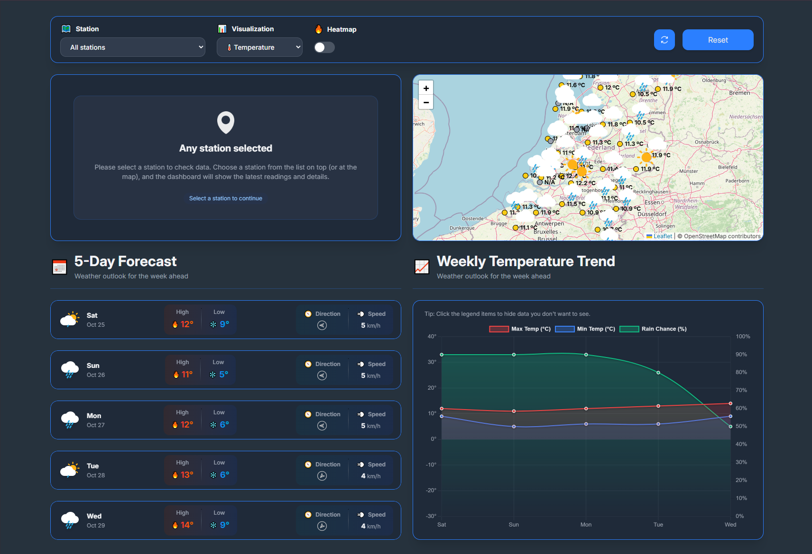
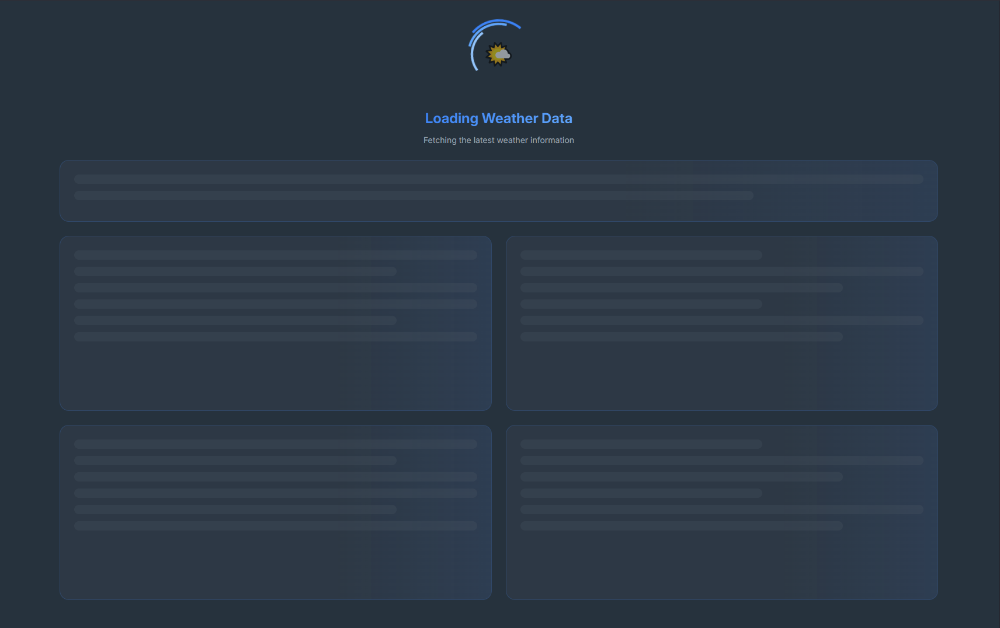
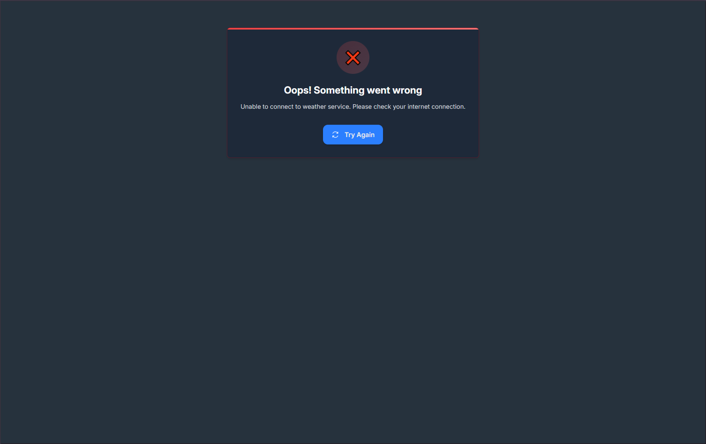
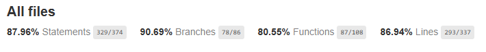

<div align="center">

# 🌤️ Weather Visualizer

### Real-time Weather Data Visualization for the Netherlands

A modern Angular application that visualizes live weather measurements from 40+ stations across the Netherlands from [GraphQL weather API](https://github.com/leoaltemari/weather-api) created tobe a proxy for [Buienradar API](https://data.buienradar.nl/2.0/feed/json) with interactive maps and realtime integration.

[](https://angular.io/)
[](https://tailwindcss.com/)
[](https://www.typescriptlang.org/)
[](https://leafletjs.com/)
[](https://www.chartjs.org/)

<div align="center">
  
</div>

</div>

## 🚀 Live Demo
- [Weather Visualizer](https://leoaltemari.github.io/weather-visualizer/weather-dashboard)

## 📋 Table of Contents

- [✨ Features](#-features)
- [🔄 Realtime Data](#-realtime-data)
- [🗂️ State Management](#️-state-management)
- [⚙️ Installation](#️-installation)
- [🚀 Usage](#-usage)
- [🧪 Unit Tests](#-unit-tests)
- [📱 Contact](#-contact)

## ✨ Features

### 📍 Interactive Weather Map

**🗺️ Station Selection**
- Click any station marker at the map to view detailed weather measurements (temperature, wind, pressure, humidity, visibility)

**📊 Visualization Modes:**

- 🌡️ **Temperature**
- 💨 **Wind Speed**
- 🌀 **Air Pressure**

**🔥 Heat Map**
- Toggle overlay to visualize geographical patterns and gradients
- Dynamically adapts to selected visualization type (Temperature/Wind/Pressure)

### 🔄 Data Controls

- **Manual Refresh** - Force immediate data update alongside automatic 5-second polling
- **Reset State** - Return to initial application state with one click

### 📅 5-Day Weather Forecast

- **📈 Interactive Chart** - Visualize daily weather trends with hover tooltips
- **🌡️ Temperature Range** - Min/max predictions with color-coded curves
- **🌧️ Rain Probability** - Percentage chance of precipitation per day
- **📆 Day Navigation** - Browse and compare 5 days of forecast data


## 🔄 Realtime Data

The application maintains live synchronization with weather stations through intelligent polling mechanisms.

### Automatic Updates

- **⏱️ Polling Interval**: Fresh data every **5 seconds**
- **🎯 Reactive Components**: Each component responds to new data emissions instantly
- **🚀 Performance Optimized**: Minimal network overhead by reusing cached structures

Components consume reactive streams through signals, ensuring **granular and smooth updates** without full-page refreshes.

### 🤔 Why Short Polling Instead of WebSockets or SSE?

The application uses **short polling** (5-second intervals) as the realtime strategy. Here's why this approach was chosen:

**Data Characteristics**
- Weather data updates are not millisecond-critical
- 5 second latency is perfectly acceptable for meteorological data
- Data sources (weather stations) typically update every 3-5 minutes

**Infrastructure Compatibility**
- No special server-side requirements (WebSocket server, SSE endpoints)
- Compatible with static hosting (GitHub Pages)
- No need for persistent connections or server push capabilities

**Cost & Resource Efficiency**
- Lower server resource consumption (no persistent connections)
- Predictable and controllable bandwidth usage
- Scales easily with standard HTTP caching strategies

**For this weather visualization application**, short polling provides the **optimal balance** between simplicity, reliability, and user experience without over-engineering the solution.

## 🗂️ State Management

Modern reactive architecture combining **RxJS**, **Signals**, and **Effects** for optimal performance.

- **RxJS Observables** handle fetching, polling, and data transformation
- **Signals** for components states management

**Why Signals on components?**
- ✅ Efficient integration with zone.js
- ✅ Perfect pairing with OnPush strategy
- ✅ Reduced unnecessary change detection cycles
- ✅ Better performance and developer experience

### 🎭 Application States

<table>
  <tr>
    <td width="50%">
      <h4>⏳ Loading State</h4>
      <p>Elegant skeletons and spinners during data fetch</p>
      
    </td>
    <td width="50%">
      <h4>❌ Error State</h4>
      <p>Non-blocking error banner with retry action</p>
      
    </td>
  </tr>
</table>

## ⚙️ Installation

### 📋 Prerequisites

Ensure you have the following installed:

- **Node.js** LTS (^20.19.0 || ^22.12.0 || ^24.0.0) - [Download](https://nodejs.org/)
- **npm**, **yarn**, or **pnpm**
- **Angular CLI**:
  ```bash
  npm install -g @angular/cli
  ```

### 🚀 Setup Steps

1. **Clone the repository**
   ```bash
   git clone https://github.com/leoaltemari/weather-visualizer.git
   cd weather-visualizer
   ```

2. **Install dependencies**
   ```bash
   npm install
   ```

## 🚀 Usage

### 💻 Development Server

Start the development server:

```bash
npm start
# or
ng serve
```

Open your browser at **http://localhost:4200**


## 🧪 Unit Tests

### 🔬 Running Tests

Execute unit tests with Karma:

```bash
npm run test:coverage
```

Code coverage was focused to achieve 80% coverage:


## 📱 Contact

- **Author**: Leonardo Altemari
- **Linkedin**: [Leonardo Altemari](https://www.linkedin.com/in/leonardo-altemari/)
- **Email**: leo.altemari@gmail.com
